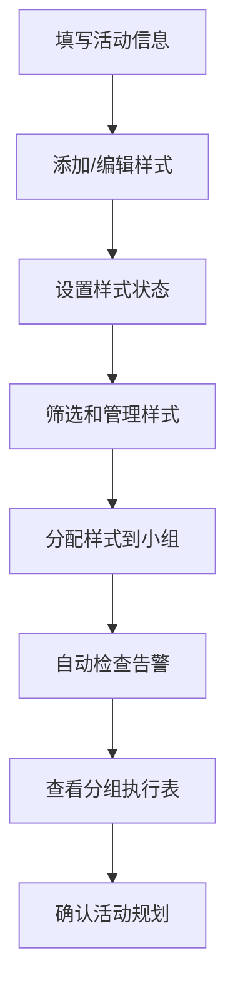

## 1. 产品概述
草编团扇工作坊活动管理系统，用于活动前分配不同样式、材料包和小组任务，实现纯前端的活动规划和分组管理。

- **主要目的**：帮助工作坊组织者高效规划草编团扇活动，管理样式、材料和分组
- **解决问题**：传统纸质规划方式效率低、难以自动检查问题、分组繁琐
- **目标用户**：工作坊组织者、手工活动策划人员

## 2. 核心 Features

### 2.1 User Roles
| 角色 | 注册方式 | 核心权限 |
|------|---------|---------|
| 组织者 | 无需注册 | 管理活动信息、样式配置、材料清单、分组执行 |

### 2.2 Feature Module
1. **活动信息管理**：顶部区域，填写活动名称、日期、总时长、总人数
2. **样式折叠面板**：单列折叠面板，管理团扇样式详情
3. **筛选功能**：按难度、材料、人数、状态筛选样式
4. **自动检查**：实时检查同组难度过高、材料缺口、重复示范要点、超时
5. **分组执行表**：分配样式到小组，生成逐组清单
6. **底部汇总条**：显示整体统计信息和告警摘要

### 2.3 Page Details
| 页面名称 | 模块名称 | 功能描述 |
|---------|---------|---------|
| 主页面 | 活动信息 | 编辑活动基本信息（名称、日期、总时长、总人数） |
| 主页面 | 样式面板 | 折叠式面板，每个样式含难度、材料清单、示范要点、适合人数、常见问题、备用方案 |
| 主页面 | 筛选栏 | 多维度筛选（难度、材料关键词、人数范围、状态标签） |
| 主页面 | 状态管理 | 四种状态：适合新手、需提前示范、材料不足、改为展示 |
| 主页面 | 自动检查 | 实时告警：同组难度过高、材料缺口、重复示范要点、活动超时 |
| 主页面 | 分组执行表 | 拖拽/选择分配样式到小组，生成逐组任务清单 |
| 主页面 | 底部汇总 | 统计总数、材料预警、分组进度、总时长校验 |

## 3. 核心流程

### 用户操作流程
1. 组织者填写活动基本信息（名称、日期、时长、人数）
2. 添加/编辑团扇样式条目，填写详细信息
3. 设置样式状态（适合新手/需提前示范/材料不足/改为展示）
4. 使用筛选功能快速查找特定样式
5. 将样式分配到不同小组
6. 系统自动检查潜在问题并告警
7. 查看分组执行表和汇总信息

## 4. 用户界面设计

### 4.1 设计风格
- **主色调**：自然绿色系（#2E7D32），体现草编手工艺的自然质感
- **辅助色**：米黄色（#FFF8E1）作为背景，棕色（#8D6E63）作为强调
- **按钮风格**：圆角矩形，轻微阴影，hover时有上浮效果
- **字体**：使用系统字体栈，标题加粗，正文清晰易读
- **布局风格**：卡片式设计，折叠面板采用平滑过渡动画
- **图标风格**：使用线性图标，与自然主题呼应

### 4.2 页面设计概述
| 页面名称 | 模块名称 | UI 元素 |
|---------|---------|---------|
| 主页面 | 顶部活动信息 | 固定高度头部，浅米色背景，左右分栏布局 |
| 主页面 | 样式折叠面板 | 手风琴式折叠，每个面板含标题栏和详情区 |
| 主页面 | 筛选栏 | 横向排列的筛选器，下拉选择和输入框组合 |
| 主页面 | 状态标签 | 彩色圆角标签，不同状态对应不同颜色 |
| 主页面 | 告警提示 | 红色/黄色警告卡片，带感叹号图标 |
| 主页面 | 分组执行表 | 表格布局，支持拖拽分配，分组卡片式展示 |
| 主页面 | 底部汇总条 | 固定底部，深色背景，白色文字，统计信息横向排列 |

### 4.3 响应式设计
- **桌面优先**：1200px 以上为最佳体验
- **平板适配**：768px-1199px，单列布局，筛选器改为垂直排列
- **移动端**：768px 以下，简化布局，优化触控区域

### 4.4 交互与动画
- 折叠面板展开/收起使用 0.3s ease 过渡
- 告警提示出现时使用轻微弹跳动画
- 分组拖拽时有半透明跟随效果
- 按钮 hover 时背景色渐变和轻微上浮
