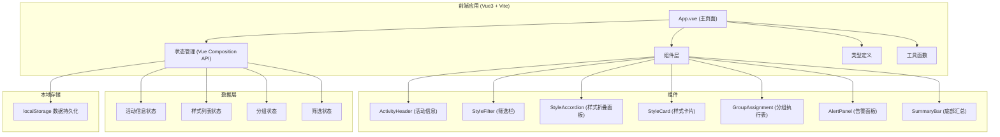

## 1. 架构设计



## 2. 技术栈说明

- **前端框架**: Vue@3 + TypeScript + Vite@5
- **CSS 框架**: Tailwind CSS@3
- **图标库**: Lucide Vue (lucide-vue-next)
- **状态管理**: Vue Composition API (reactive/ref)
- **数据持久化**: localStorage
- **构建工具**: Vite

## 3. 项目结构

```
src/
├── components/
│   ├── ActivityHeader.vue      # 顶部活动信息组件
│   ├── StyleFilter.vue         # 筛选栏组件
│   ├── StyleAccordion.vue      # 样式折叠面板容器
│   ├── StyleCard.vue           # 单个样式卡片组件
│   ├── GroupAssignment.vue     # 分组执行表组件
│   ├── AlertPanel.vue          # 告警面板组件
│   └── SummaryBar.vue          # 底部汇总条组件
├── composables/
│   ├── useActivity.ts          # 活动信息管理
│   ├── useStyles.ts            # 样式列表管理
│   ├── useGroups.ts            # 分组管理
│   ├── useFilter.ts            # 筛选功能
│   └── useAlerts.ts            # 告警检查
├── types/
│   └── index.ts                # TypeScript 类型定义
├── utils/
│   └── storage.ts              # localStorage 工具
├── data/
│   └── mockData.ts             # 示例数据
├── App.vue                     # 主应用组件
└── main.ts                     # 入口文件
```

## 4. 路由定义

| 路由 | 用途 |
|------|------|
| / | 主页面（单页应用，无额外路由） |

## 5. 数据模型

### 5.1 数据模型定义

```mermaid
erDiagram
    ACTIVITY ||--o{ STYLE : contains
    STYLE ||--o{ MATERIAL : has
    STYLE ||--o{ FAQ : has
    GROUP ||--o{ STYLE : assigned
    
    ACTIVITY {
        string id PK
        string name
        string date
        number totalDuration
        number totalPeople
    }
    
    STYLE {
        string id PK
        string name
        string difficulty
        number suitablePeople
        number duration
        string status
        string demoPoints
        string backupPlan
    }
    
    MATERIAL {
        string id PK
        string name
        number quantity
        string unit
    }
    
    FAQ {
        string id PK
        string question
        string answer
    }
    
    GROUP {
        string id PK
        string name
        number peopleCount
        string[] styleIds
    }
```

### 5.2 TypeScript 类型定义

```typescript
// 样式状态类型
export type StyleStatus = 'beginner' | 'demo-required' | 'insufficient-material' | 'display-only';

// 难度等级
export type DifficultyLevel = 'easy' | 'medium' | 'hard' | 'expert';

// 材料项
export interface MaterialItem {
  id: string;
  name: string;
  quantity: number;
  unit: string;
}

// 常见问题
export interface FAQ {
  id: string;
  question: string;
  answer: string;
}

// 团扇样式
export interface FanStyle {
  id: string;
  name: string;
  difficulty: DifficultyLevel;
  suitablePeople: number;
  duration: number;
  status: StyleStatus;
  materials: MaterialItem[];
  demoPoints: string;
  faqs: FAQ[];
  backupPlan: string;
}

// 小组
export interface Group {
  id: string;
  name: string;
  peopleCount: number;
  styleIds: string[];
}

// 活动信息
export interface ActivityInfo {
  name: string;
  date: string;
  totalDuration: number;
  totalPeople: number;
}

// 告警类型
export type AlertType = 'high-difficulty' | 'material-shortage' | 'duplicate-demo' | 'time-exceeded';

export interface Alert {
  id: string;
  type: AlertType;
  severity: 'warning' | 'error';
  message: string;
  details?: string;
}

// 筛选条件
export interface FilterCriteria {
  difficulty?: DifficultyLevel;
  materialKeyword?: string;
  minPeople?: number;
  maxPeople?: number;
  status?: StyleStatus;
}
```

## 6. 核心算法

### 6.1 自动检查逻辑

1. **同组难度过高检查**
   - 遍历每个小组
   - 统计每个小组中难度为 'hard' 或 'expert' 的样式数量
   - 如果超过 1 个，触发告警

2. **材料缺口检查**
   - 汇总所有已分配样式的材料需求
   - 计算总需求量
   - 标记状态为 'insufficient-material' 的样式材料

3. **重复示范要点检查**
   - 提取所有已分配样式的示范要点
   - 使用相似度算法检测重复内容
   - 相似度超过阈值时触发告警

4. **活动总时长检查**
   - 计算所有已分配样式的总时长
   - 与活动设定的总时长比较
   - 超出时触发告警

### 6.2 分组算法

- 支持手动拖拽分配
- 自动平衡各小组人数
- 建议最优分配方案（可选功能）
